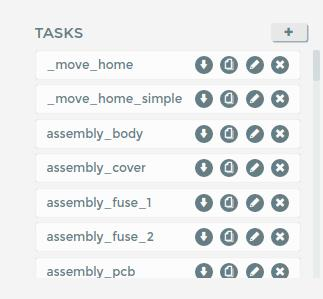

<!-- PROJECT SHIELDS -->
<!--
*** I'm using markdown "reference style" links for readability.
*** Reference links are enclosed in brackets [ ] instead of parentheses ( ).
*** See the bottom of this document for the declaration of the reference variables
*** for contributors-url, forks-url, etc. This is an optional, concise syntax you may use.
*** https://www.markdownguide.org/basic-syntax/#reference-style-links
-->

<!-- PROJECT LOGO -->
 

  

  <h3 align="center">Galaxy Franka Driver</h3>

  

    Your best chance at controlling Franka Emika Panda beasts.
     
  

<!-- TABLE OF CONTENTS -->

  
<h2 style="display: inline-block">Table of Contents</h2>

  <ol>
    <li>
      <a href="#about-the-project">About The Project</a>
    </li>
    <li>
      <a href="#getting-started">Getting Started</a>
      <ul>
        <li><a href="#prerequisites">Prerequisites</a></li>
      </ul>
    </li>
    <li><a href="#usage">Usage</a></li>
    <li><a href="#contributing">Contributing</a></li>
    <li><a href="#license">License</a></li>
    <li><a href="#contact">Contact</a></li>
  </ol>

<!-- ABOUT THE PROJECT -->
## About The Project

Hey everyone, I am Jevgenijs `Galaxy` Galaktionovs. This project is a collection of functions to control Franka Emika robots via code. The purpose of this repository is to collect common Franka functions under one source and use it as a driver submodule in other projects. The project consists of 3 main points:
- C++ 'driver' containing common robot commands, such as move, set parameters, read states, etc.
- Python Web API containing methods to send requests to Franka Desk web browser API. For example, you can open and lock brakes on Franka robot.
- HMI Modbus Panel intrusctions & files.

In case if this README file is not sufficient or more questions arise, feel free to contact me at **jevgenygalaktionov@gmail.com**.

<!-- GETTING STARTED -->
## Getting Started

This repository is made in ROS infrastructure. To use this repo, one must clone it to *catkin_workspace/src/* directory, and *catkin_make* it. But *OPS!*, it won't compile because one is missing dependencies. Read below about them. After the package is successfully installed, C++ example can be run by `rosrun franka_driver franka_example`, and Python Web API example can be run `python3 path/to/example_franka_web_API.py`.

### Prerequisites
- Linux with patched Kernel for Preemtiveness. See `doc/installation_manuals/alternative_real-time_kernel_INSTALLATION_process` for instructions.
- ROS Melodic (maybe earlier versions too, don't know)
- cmake at least3.10
- Following packages are all dependences of submodule 'frankx' and must be installed on your system:
  1. Eigen v3.3.7
  2. Libfranka v0.7.1
  3. Pybind11 v2.6.0
  4. Catch2 v2.9 (only for testing)
See `doc/installation_manuals/install_frankx.txt` for some instructions (NEEDS UPDATE)

<!-- USAGE EXAMPLES -->
## Usage

There are three components in this module: C++ library, Python Web API, and HMI Modbus Panel intrusctions.

**For C++ library:**
File `src/example_franka_driver.cpp` contains example functional calls from C++ library.
There is still some functionality missing, like most of the robot motions. One could look into sub-module `frankx` for further work on this.

**For Python Web API:**
File `src/example_franka_web_API.py` contains example functional calls to Franka Desk Web interface. One can do things like lock/unlock brakes on Franka, execute tasks, switch modes.
- **IMPORTANT**: login and password must be provided inside the example (check line 6-7 in the file).
- **IMPORTANT2**: most API calls are replicating common functionality in Desk interface. Although, ` franka_execute_task` function requires a task name to be passed into the function. This `task_name` is the name of the task as it appears in Desk Interaface:

**HMI Modbus Panel:**
Directory `doc/HMI_panel` contains manuals on how to connect a HMI Modbus module to Franka robot and how to use. This module is a custom made solution by PKJ Robotics, Denmark. Explanation of the files in the directory:
- `HMI-Modbus Panel User Documentation_v1.pdf`: PKJ Robotic manual on how to install and use Modbus module. I personally find it not clear enough so I have made a supplementary guide with comments, photos, and guidance. See next point.
- `modbus_panel_manual.docx`: Supplementary manual on how to install and use a Modbus module from PKJ Robotics.
- `HMI_PKJ_demo.task`: Demo task for HMI Modbus module provided by PKJ Robotics. Drag the file into Desk Task space and it will appear there. Requires Modbus module to be connected and configured for Franka.
- `HMI_AAU_demo.task`: Same as above, just slightly remade...
- `HMI_Modbus Panel_v1.0.json`: Configuration file for Modbus module. Read manuals below for explanations on where and how to install it.
- `onepager_HM Modbus Panel.pdf` Some one-pager documentation on Modbus panel from PKJ Robotics. Useless.

<!-- CONTRIBUTING -->
## Contributing

Contributions are what make the open source community such an amazing place to be learn, inspire, and create. Any contributions you make are **greatly appreciated**.

1. Fork the Project
2. Create your Feature Branch (`git checkout -b feature/AmazingFeature`)
3. Commit your Changes (`git commit -m 'Add some AmazingFeature'`)
4. Push to the Branch (`git push origin feature/AmazingFeature`)
5. Open a Pull Request

<!-- CONTACT -->
## Contact
Jevgenijs Galaktionovs - [Really A Robot](www.reallyarobot.com) - jga@reallyarobot.com

Casper Schou  - Assistant Professor at Robotics and Automation Group, AAU - cs@mp.aau.dk
